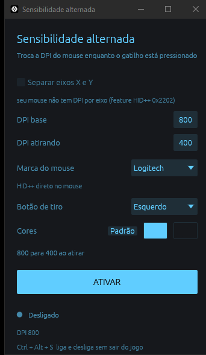

# Sensibilidade alternada

Troca a **DPI do mouse** enquanto o botão de tiro está pressionado, para jogar no
BlueStacks com uma sensibilidade para se movimentar e outra, mais precisa, para atirar.

Sem driver, sem instalar nada no kernel, sem depender do software do fabricante estar
aberto.



## Marca do mouse

Não existe comando padronizado para trocar DPI: cada fabricante tem o seu protocolo. Por
isso o painel tem um **seletor de marca**, e o motor muda com ela.

| Marca | Método | Estado |
|---|---|---|
| **Logitech** | HID++ direto no mouse | funciona — **3,74 ms** por troca, medido em hardware |
| **Genérico (SINOWEALTH)** | troca de perfil no mouse | implementado, **não verificado em hardware** |
| **Sem marca** | driver RawAccel | **não utilizável**, ver abaixo |

Se o motor da marca escolhida não encontrar o dispositivo, o painel diz isso e o ATIVAR
fica desligado — em vez de fingir que está agindo.

### Genérico (SINOWEALTH)

SINOWEALTH é o fabricante do **chip**, não do mouse — por isso o mesmo protocolo aparece em
dezenas de marcas e em mouses sem marca nenhuma. O identificador é o VID `258a`.

A alternância se faz por **troca de perfil**, um comando de 6 bytes. O caminho óbvio — mudar
o slot de DPI ativo — exigiria reescrever um relatório de **520 bytes** que vai para a
memória persistente do mouse: fazer isso a cada tiro gastaria os ciclos de gravação do
dispositivo. Por isso o motor **recusa** mouses que só exponham um perfil, dizendo o motivo,
em vez de estragar o hardware para entregar a função.

Como usar: configure dois perfis no mouse, o primeiro com a DPI de movimentação e o segundo
com a de tiro. O painel só alterna entre eles — os valores vêm do próprio mouse, e os campos
de DPI ficam somente-leitura.

> ⚠ **Não passou por hardware.** O enquadramento do protocolo é testado byte a byte contra o
> `driver-sinowealth.c` do libratbag, e as falhas são tratadas como recusa, nunca como
> sucesso silencioso — mas nenhum mouse SINOWEALTH foi testado. Se o seu não funcionar, o
> painel mostra o identificador (`258a:xxxx`) para você relatar.

### Por que "Sem marca" não funciona hoje

O RawAccel é o candidato natural para o caminho genérico: é um driver de filtro, transforma
as contagens do mouse antes do sistema vê-las, e por isso serviria a qualquer marca.

Mas ele tem um limite que vem do próprio fonte. `common/rawaccel-io-def.h` define **três**
IOCTLs — `READ`, `WRITE`, `GET_VERSION` — e nenhum liga-desliga rápido. E em
`driver/driver.cpp`, o `case ra::WRITE` chama `WriteDelay()` **antes de ler o buffer**, com
`WRITE_DELAY = 1000` ms. Um segundo por escrita, no kernel, incondicional. A FAQ oficial
confirma o porquê: *"it is fully signed and has a one-second delay on write, so it cannot be
used to cheat"*.

Na prática: segurar o gatilho mudaria a sensibilidade **um segundo depois**, e soltá-lo a
devolveria outro segundo depois. Chega quando a rajada já acabou. O motor detecta o driver e
relata; não finge atender.

### Acrescentar uma marca

1. Nova variante em `src/brand.rs`, com `label()` e `method()` — os testes cobram rótulo e
   método distintos, que é o erro de lista copiada.
2. Um módulo de protocolo puro, testável sem hardware, no formato de `src/hidpp.rs` ou
   `src/sinowealth.rs`.
3. Um módulo de dispositivo que use `src/hid.rs` para achar a coleção.
4. Um braço em `Engine::for_brand`, em `src/engine.rs`.

Nada mais precisa mudar: o painel e a persistência já acompanham. E procure sempre o
**comando de seleção** (perfil, slot, índice) — nunca o de escrita de configuração, que
costuma gravar na memória persistente do mouse.

## Baixar

[**Última versão**](https://github.com/S2-DaPaz/sensi-alternada/releases/latest) — um `.exe`,
sem instalador, Windows 10/11 x64. O binário não é assinado, então o SmartScreen avisa no
primeiro arranque: **Mais informações → Executar assim mesmo**. Quem preferir compila do
fonte e compara o hash publicado na release.

## Como usar

1. Rode o `.exe`, ou compile com `cargo build --release`.
2. **DPI base** — a DPI que você quer para se movimentar.
3. **DPI atirando** — a DPI enquanto o gatilho está pressionado. Menor = mais precisão.
4. **Botão de tiro** — esquerdo, direito, meio, lateral 1 ou lateral 2.
5. **Cores** — dois seletores: um para os botões e as letras, outro para o fundo.
6. **ATIVAR**, ou `Ctrl + Alt + S` a qualquer momento, inclusive com o jogo em tela cheia.

A troca só acontece com o **BlueStacks em foco**. No resto do Windows o mouse fica na DPI
base. Desligar restaura a base imediatamente, mesmo com o gatilho pressionado.

## Por que DPI, e não escalar o movimento

A primeira versão deste projeto escalava o ponteiro do Windows. Funcionava com precisão
exata — erro de 0 px, medido — e **o jogo não percebia nada**.

O motivo, medido em 28/08/2026: o modo de tiro do BlueStacks lê as **contagens cruas do
dispositivo**, não o cursor. A prova é direta — trocar a DPI pelo software do mouse muda a
sensibilidade no jogo; escalar o cursor não muda nada. Nenhum truque em user-mode alcança
isso.

Trocar a DPI muda as contagens no firmware, antes de qualquer camada de software. Por isso
chega ao jogo.

E não precisa de driver: mandar comando **ao** mouse é HID comum, de user-mode. Driver só
seria necessário para **interceptar** o que o mouse manda — que é o que o RawAccel faz, e
que o RawAccel não permite reaproveitar: ele tem, por design, **1000 ms de atraso em toda
escrita de configuração** (`WRITE_DELAY` em `rawaccel-base.hpp`).

Medido neste projeto, num G203: **3,74 ms de média** por troca de DPI, pior caso 4,13 ms,
zero erros em 10 trocas.

## DPI por eixo X e Y

Só funciona se o mouse tiver a feature HID++ `0x2202` (*Extended Adjustable DPI*). O G203
**não tem** — o painel detecta isso, desabilita a caixa e diz o porquê, em vez de aceitar
um valor que seria ignorado.

## Variáveis de ambiente

| Variável | Para quê |
|---|---|
| `SENSI_TARGET_EXE` | Outro emulador — `LDPlayer.exe`, `AndroidEmulator.exe`. `*` vale em qualquer janela. |
| `SENSI_DEBUG=1` | Escreve o estado do motor em `%TEMP%\sensi-debug.txt`. |

## Alternativa sem este programa

Se você já usa o G HUB, o script em
[`docs/logitech-g-hub/`](docs/logitech-g-hub/sensibilidade-alternada.lua) faz o mesmo por
dentro dele, em ~15 linhas de Lua. Este painel existe para não depender do G HUB e para,
mais adiante, cobrir outras marcas.

## O que este projeto não faz, por decisão

Compensação de recuo e autofire. Trocar DPI não automatiza ação nenhuma, e keymapping em
emulador oficial com cliente não modificado é permitido pela Garena. Recuo automático e
disparo em laço são macro, são observáveis dentro do jogo, e são banimento.

## Testes

```
cargo test
```

O enquadramento do protocolo HID++ é testado sem hardware, inclusive contra bytes reais
capturados de um G203. A conversa com o dispositivo e o painel se verificam rodando.
